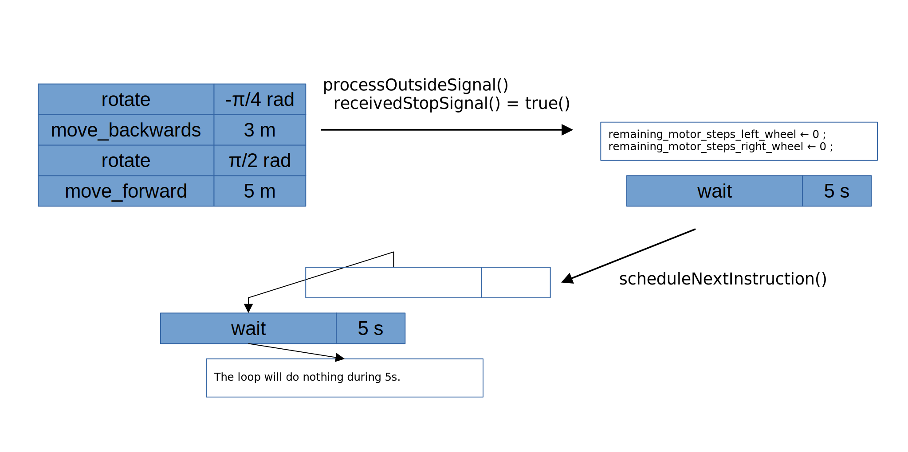

# Robot's low-level behaviour
Here is an algorithm to enable the execution of a versatile high-level algorithm of strategy from elementary calls of motor rotation steps. 

## Electronic interactions
The rotation steps are done at each electronic card's loop from some global status variables such as `remaining_motor_steps_*` (`r_pas*` variables in [the main script](../motors/code_arduino_uno_steppers_fonctionnel_051220023.ino)) which indicates whether each wheel still has to turn. We model this execution by the call of the `executeOneMotorStep` function. A step execution obviously decrements the `remaining_motor_steps_*` variable for each rotating wheel.


## Intermediate-level instruction
Repeating several rotation steps on the correct wheels, the robot is able to rotate by any angle and to move forward/backward by any distance. In the following part of this documentation, these two kinds of task are being called *intermediate-level instructions* (*ILIs*).

Just one of them at a time can be carried out by the electronic card's loop. To execute a range of ILIs, a queue of pending ILIs is therefore allocated.  
The execution of the first prioritary ILI is done by calling once the `scheduleNextInstruction` function, which pop it from the head of the queue and read it to relevantly change the values of the `remaining_motor_steps_*` status variables. 
The next ILI is scheduled when all the required steps have been run to achieve the current ILI. In that case, the function `taskDoneWithSuccess` returns `true()` and `scheduleNextInstruction` is called again.

With these features, the robot is already able to sequentially achieve a range of ILIs with the following code in the electronic card's `loop` function: 

```
function loop()
begin
    if taskDoneWithSuccess() do
		scheduleNextInstruction();
	executeOneMotorStep();
end
```

```
function taskDoneWithSuccess()
begin
	if remaining_motor_steps_left_wheel = 0 = remaining_motor_steps_right_wheel do
		return true();
	else
		return false();
end
```

## (Re)Setting the ILIs queue

It may happen that the current range of pending ILIs is not relevant anymore given the current state of the robot's environment. In this case, we have interest to reset the ILIs queue.

### Interrupting an ILI on outside signal reception

The electronic card can receive an external stop signal (e.g. an emergency stop from an external device). Assuming the information is stocked in an inbox which can be processed in the thread of the `loop` function, then we can add an outside signal processing task in the loop.
```
function loop()
begin
	processOutsideSignals();
	if taskDoneWithSuccess() do
		scheduleNextInstruction();
	executeOneMotorStep();
end
```
>NB: To avoid any latency issue, this instruction can also be executed each `DELTA_T` loops:
>```
>function loop()
>begin
>    if t = DELTA_T do
>    begin
>        t ← 0;
>        processOutsideSignals();
>    endif
>    if taskDoneWithSuccess() do
>        scheduleNextInstruction();
>        t ← t + 1; 
>    executeOneMotorStep();
>end
>```

The `processOutsideSignal` function may stop the running ILI by reset the step status variables to 0. In this case, we consider that all the pending ILIs have to be canceled so the instruction queue has to be cleared. We can force the robot to stay stopped during a delay by adding a special waiting ILI in the beginning of the new queue.
```
function processOutsideSignal()
begin
    if receivedStopSignal() do
    begin
        remaining_motor_steps_left_wheel ← 0;
        remaining_motor_steps_right_wheel ← 0;
        clear(instructionQueue);
        enqueue(instructionQueue, waitingInstruction());
    end
end
```


### Computing a new strategy

If the instruction queue is empty in the initialisation or after an interruption or the achivement of all the scheduled tasks, then the robot artificial intelligence has to enqueue a new range of ILIs from the strategy it has decided to take according to an analysis of its environment. The function to refresh the queue is called `inspectEnvironmentAndComputeNewStrategy` and is called in the `scheduleNextInstruction` function. Here is its final definition :
```
function scheduleNextInstruction();
begin
	if isempty(instructionQueue) do
		inspectEnvironmentAndComputeNewStrategy();
	newInstruction ← dequeue(instructionQueue);
	setMotorSteps(newInstruction);
end
```

> The definition of `inspectEnvironmentAndComputeNewStrategy` is coming soon in another documentation.
